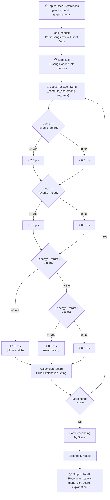

# Music Recommender — Data Flow

## Score Breakdown Table

| Rule | Points |
|---|---|
| Genre matches `favorite_genre` | +2.0 |
| Mood matches `favorite_mood` | +1.0 |
| \|energy − target\| ≤ 0.10 | +1.0 |
| \|energy − target\| ≤ 0.20 | +0.5 |
| No match on any criterion | 0.0 |
| **Max possible score** | **4.0** |

## Trace Example

User prefs: `genre="pop"`, `mood="happy"`, `energy=0.8`

| Song | Genre | Mood | Energy | Score | Why |
|---|---|---|---|---|---|
| Sunrise City | pop ✅ | happy ✅ | 0.82 ✅ | **4.0** | all three match |
| Rooftop Lights | indie pop ❌ | happy ✅ | 0.76 ✅ | **2.0** | mood + energy near |
| Gym Hero | pop ✅ | intense ❌ | 0.93 ❌ | **2.0** | genre only |
| Block by Block | hip-hop ❌ | confident ❌ | 0.80 ✅ | **1.0** | energy close match |
